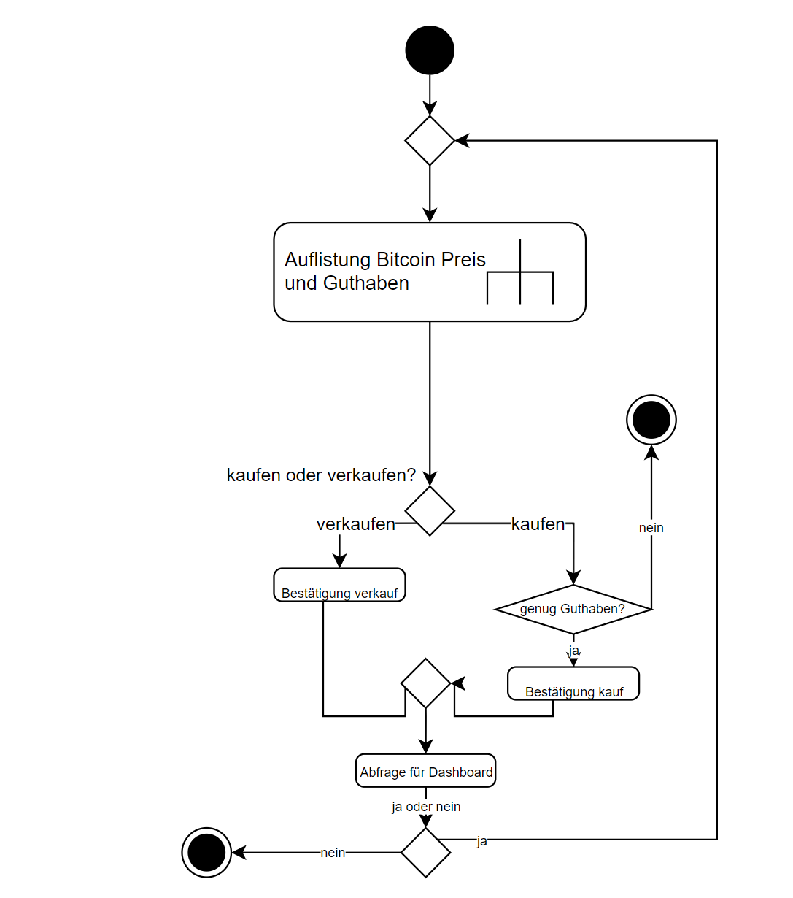

# Erarbeitung Begriffe
Nicht Teil dieser Kompetenz

# Projekt / Umsetzung
Themenbereich: Kryptowährungen kauf / verkauf 

Für diese Kompetenz wird in einer Klasse (prozedural) abgefragt ob man Bitcoin kaufen oder verkaufen will. Falls man Bitcoin kaufen will aber nicht genug Guthaben hat, wird das Programm beendet. Ansonsten wird abgefragt ob man wieder zurück will zum Dashboard.

